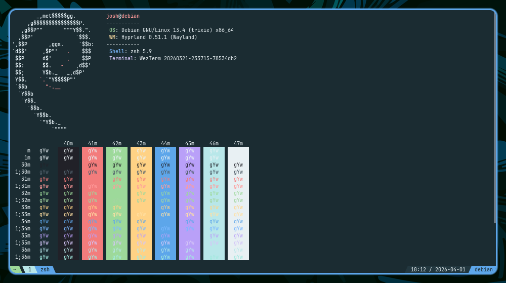

# Fjord Theme for WezTerm

A dusk-blue base with soft leaf-green accents, cyan selections, and crisp blue/cyan separation for WezTerm.




## 🎨 Color Palette

### Core Colors

| Color | Name |
| ---- | ----------------- |
|  | **background** |
|  | **backgroundAlt** |
|  | **surface** |
|  | **line** |
|  | **foreground** |
|  | **muted** |
|  | **mutedDim** |

### Accent Colors

| Color | Name |
| ---- | ---------------------------- |
|  | **green** _(primary accent)_ |
|  | **blue** |
|  | **yellow** |
|  | **purple** |
|  | **red** |
|  | **cyan** |

## 📦 Installation


### Manual Installation


1. Clone the theme to your config directory:

```bash
mkdir -p ~/.config/wezterm/colors/
git clone https://git.jshuntley.com/fjord-theme/fjord-wezterm.git --depth 1 ~/.config/wezterm/colors/fjord-wezterm
```

2. Add to your config (`~/.wezterm.lua`):
```lua
config.color_scheme_dirs = { os.getenv("HOME") .. "/.config/wezterm/colors/fjord-wezterm/themes" }
config.color_scheme = "fjord"
```

3. Restart WezTerm to apply the theme.


## 🔧 Configuration

The theme includes:

- Complete 16-color terminal palette
- Optimized background and foreground colors
- Custom selection and cursor colors
- Enhanced readability with proper contrast ratios
## 🔄 Updates

This theme is automatically generated from [fjord-core](https://github.com/fjord-themes/fjord-core) and deployed on every release. For an overview of all supported platforms and the full color palette, visit the [Fjord GitHub page](https://github.com/fjord-themes).
## ☕ Support My Work

If you enjoy the Fjord theme and find it useful, consider supporting my work:

[](https://buymeacoffee.com/jshuntley)
## 📄 License

MIT License - see [LICENSE](LICENSE) file for details.
## 🤝 Contributing

For theme suggestions or issues, please open an issue on the [Fjord GitHub page](https://github.com/fjord-themes).